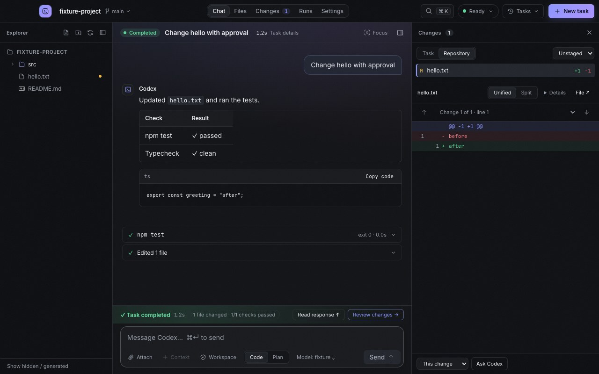
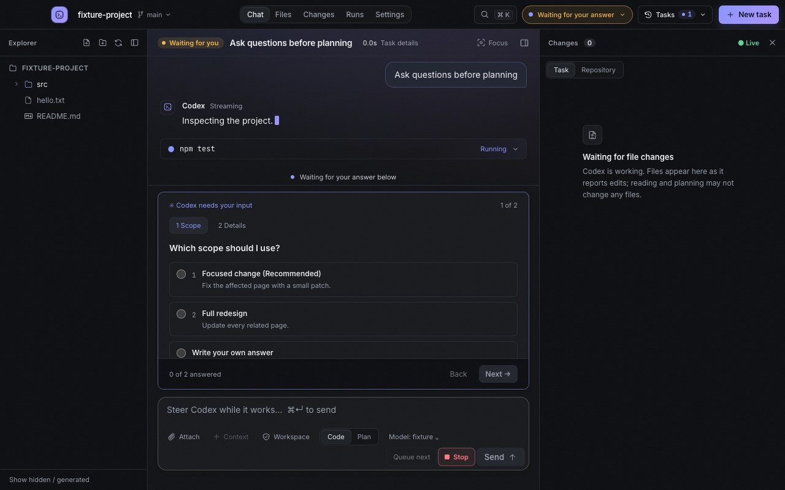
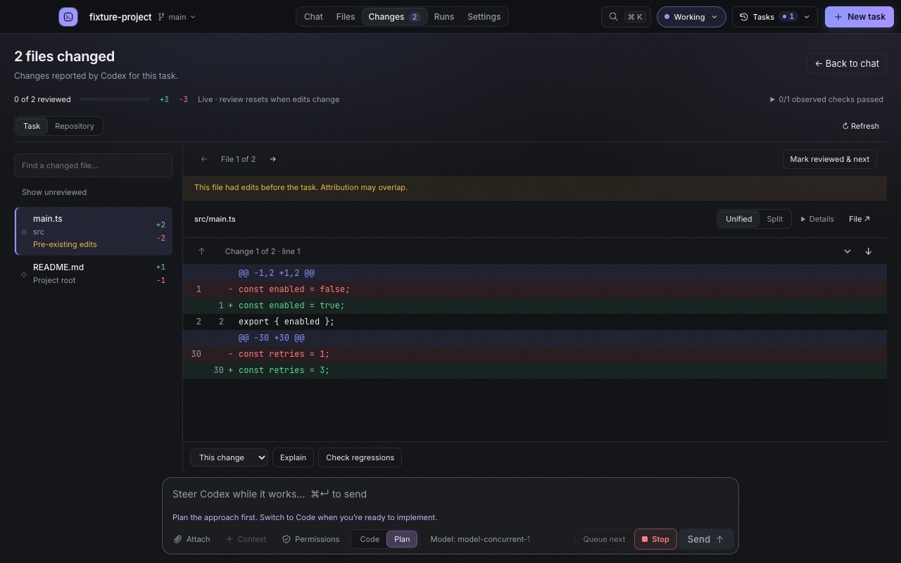
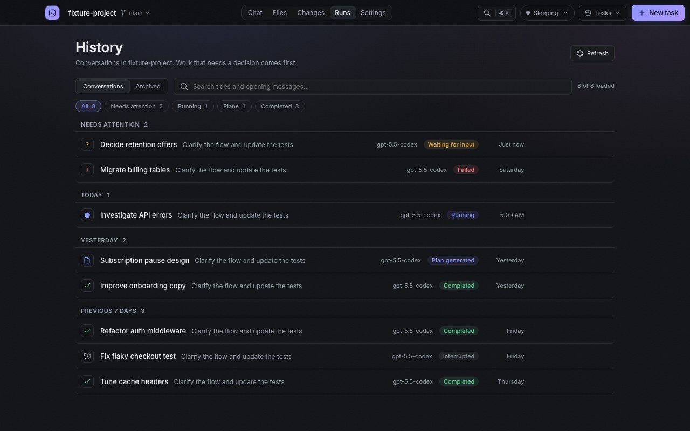
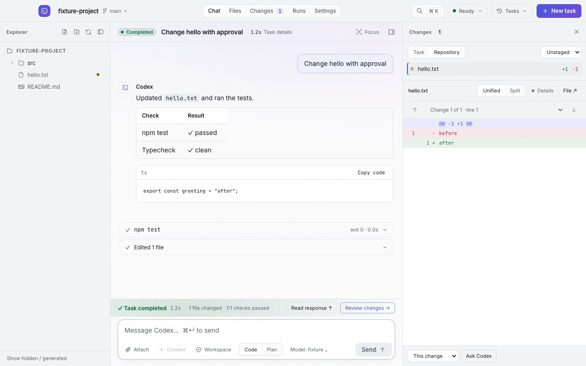
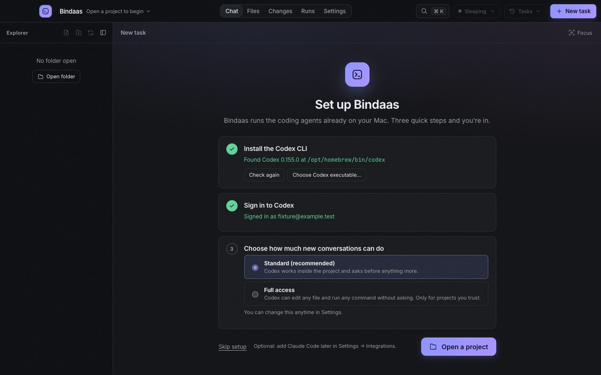

# Bindaas

**Code bindaas. Let the agents sweat.**

Bindaas is a calm, fast desktop app for working with coding agents on your Mac. It drives the coding agents you already have — the **Codex CLI**, **Claude Code**, or both: watch them work live, answer their questions, approve what they ask for, review every change, and keep your project files in reach — without an IDE running in the background.



> **Unofficial.** Bindaas is an independent open-source project. It is not affiliated with, endorsed by, or sponsored by OpenAI or Anthropic. Codex and ChatGPT are trademarks of OpenAI; Claude is a trademark of Anthropic.

## What you get

- **Live agent activity** — streamed answers, commands, file edits, and plans as they happen, grouped so you can follow along without noise.
- **Decisions where you type** — questions and approval requests dock right above the composer.
- **Review before you trust** — a dedicated review view for every patch, with per-file review marks and one-click "Explain" or "Check regressions" follow-ups.
- **Your project, not an IDE** — a lightweight explorer and editor: create, rename, trash, and edit files; Markdown preview; `@` mentions to point the agent at any file.
- **Many tasks at once** — run conversations in parallel, even across projects (one window each), get notified when a background task finishes or needs you, and find anything later in History (`⌘K` searches it all).
- **Plan or Code** — ask for a plan first, then turn it into an implementation.
- **Quiet by design** — no telemetry, no background indexing, and agents sleep when idle. An optional Power saving mode turns off every animation.

|  |           |
| -------------------------------------------------------------- | -------------------------------------------------- |
|                             |  |

## Requirements

- A Mac with **Apple silicon** (M1 or later) running **macOS 13.1 or later**.
- At least one coding agent, signed in:
  - the **[Codex CLI](https://github.com/openai/codex) 0.154.0 or later** (ChatGPT account or API key), or
  - **[Claude Code](https://docs.anthropic.com/en/docs/claude-code) 2.1.274 or later** (Claude subscription or API key).
- With both, you choose the agent per conversation.

## Install

1. Download the latest **`Bindaas_x.y.z_aarch64.dmg`** from [Releases](https://github.com/solo-novato/bindaas/releases).
2. Open it and drag **Bindaas** into **Applications**.
3. Bindaas isn't notarized by Apple yet, so macOS blocks the first launch. Allow it once with:

   ```sh
   xattr -dr com.apple.quarantine /Applications/Bindaas.app
   ```

   Then open Bindaas normally. (Alternatively: try to open it, then choose **Open Anyway** in **System Settings → Privacy & Security**.)

Full instructions, including building from source, are in **[docs/INSTALL.md](docs/INSTALL.md)**.

## First run

Bindaas opens with a short setup:

1. **Set up a coding agent.** Bindaas looks for the Codex CLI and Claude Code (Homebrew, npm, nvm, Volta, bun, `~/.local/bin`, or your shell's `PATH`) and shows the install commands for whichever is missing. One is enough.
2. **Sign in.** Codex: **Sign in with ChatGPT**, or run `codex login`. Claude Code: run `claude auth login`, then **Use Claude Code**. Bindaas never sees your credentials.
3. **Choose how much new Codex conversations can do** — _Standard_ (workspace access, asks when needed) or _Full access_. Claude Code follows its own permission settings.

Then open a project folder and describe a task.



## Everyday use

- **Start a task:** open a project, type in the composer, press `⌘↵`. Choose **Code** to implement or **Plan** to discuss the approach first. With both agents set up, pick **Codex** or **Claude** in the composer; new conversations start with the one you used last.
- **Point at files:** type `@` to find any file in the project, or right-click a file → **Add to chat**. Attach files or paste screenshots with **Attach**.
- **Steer while it works:** with Codex, sending during a task adds your message to the running turn. **Queue next** (then **Add to queue**) lines up follow-ups in order; Claude's Send button queues while it works.
- **Line up the next steps:** keep up to 20 follow-ups per conversation, each with its own mode, model, attachments, and context. Expand **Task queue** to reorder, edit, or remove steps. Editing pauses the queue; **Resume queue** continues after the current turn finishes. A failed, interrupted, or disconnected task pauses remaining work for your review. **Send now** sends only the first entry and leaves a paused queue paused. Queues and unfinished edits stay with their conversation when you switch tasks, but are kept only while the window is open; closing warns before discarding queued work.
- **Answer and approve:** questions and approvals appear above the composer. Nothing runs past a decision without you.
- **Review:** open **Changes** to walk through each patch, mark files reviewed, or ask a scoped follow-up.
- **Recover:** **↻ Retry** resends a failed task; **Rewrite** on your latest message removes it from the conversation and puts it back in the composer (files already changed stay as they are).
- **Files:** use the explorer's **New file / New folder**, or right-click for Rename (`F2`), Copy path, Reveal in Finder, and Move to Trash (`⌘⌫`).
- **Several projects at once:** each project gets its own window. Press `⌘⇧N` for a new window, or `⌘↵` on a project in the project menu. While tasks run, picking another project opens it in a new window, so nothing is interrupted. Windows reopen where you left them.

| Shortcut    | Action                              |
| ----------- | ----------------------------------- |
| `⌘K`        | Search tasks, files, and actions    |
| `⌘P`        | Find a file in the project          |
| `⌘N`        | New task                            |
| `⌘⇧N`       | New window (another project)        |
| `⌘↵`        | Send                                |
| `⌘1` – `⌘4` | Chat, Files, Changes, History       |
| `⌘⇧F`       | Focus mode                          |
| `⌘⇧L`       | Jump to the composer                |
| `⌘⇧M`       | Toggle Power saving (no animations) |
| `⌘F`        | Search the conversation or file     |
| `⌘S` / `⌘W` | Save / close a file tab             |
| `⌘O`        | Open a project                      |

## Permissions and safety

Agents can read and change files and run commands on your Mac. Bindaas keeps you in charge:

- New conversations start with **Standard** access: Codex works inside the project and asks before doing more. You can make **Full access** the default in **Settings → New conversations** — use it only for projects you trust.
- Existing conversations keep their own permissions; Bindaas never changes them unless you do (composer → permissions button).
- Claude Code conversations use Claude's own permission rules.
- File actions never overwrite existing files, and Bindaas refuses to rename or trash files with unsaved edits. "Open in default app" won't launch apps, scripts, or installers.

## Privacy

Bindaas sends **no telemetry** and makes no network requests of its own. Your conversations are stored by Codex and Claude Code, as usual. Bindaas keeps only its preferences and your message attachments (capped at 200 MiB) in:

```text
~/Library/Application Support/dev.bindaas.desktop/
```

## Troubleshooting

- **"Codex CLI not found"** — install it (`npm install -g @openai/codex` or `brew install codex`), then use **Check again** in setup or **Settings → Connect / refresh**. You can also point Bindaas at the executable in **Settings → Codex executable**. If you only use Claude Code, you don't need Codex at all.
- **Claude Code not found or not signed in** — install it (`npm install -g @anthropic-ai/claude-code`), run `claude auth login`, then **Check again** in setup (**Settings → About → Run setup again**) or **Settings → Integrations → Connect Claude Code**.
- **"Bindaas is damaged and can't be opened"** — that's macOS quarantine on an un-notarized app; run the `xattr` command from [Install](#install).
- **Codex is too old** — update with `npm install -g @openai/codex@latest` or `brew upgrade codex`.
- **Reporting a bug** — **Settings → About → Copy diagnostics** copies versions and connection state (no file contents or conversations) to paste into an [issue](https://github.com/solo-novato/bindaas/issues).

## Uninstall

Quit Bindaas, delete it from Applications, and optionally remove its data:

```sh
rm -rf ~/Library/Application\ Support/dev.bindaas.desktop ~/Library/Caches/dev.bindaas.desktop ~/Library/WebKit/dev.bindaas.desktop
```

## Contributing

Bug reports, ideas, and pull requests are welcome — see **[CONTRIBUTING.md](CONTRIBUTING.md)** for setup, tests, and guidelines, and the [architecture notes](docs/architecture/). Please follow the [Code of Conduct](CODE_OF_CONDUCT.md) and report security issues privately as described in [SECURITY.md](SECURITY.md).

## License

[MIT](LICENSE) © The Bindaas contributors. Bundled third-party components are listed in [THIRD_PARTY_NOTICES.md](THIRD_PARTY_NOTICES.md).
